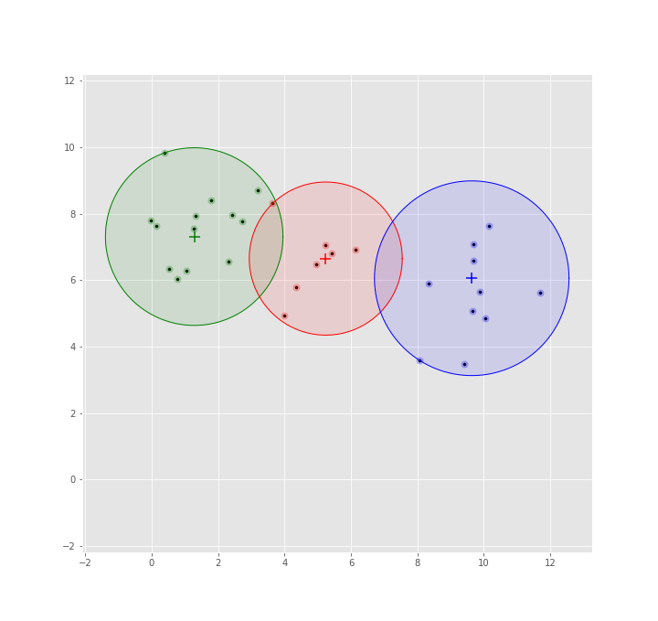

# MeanShift Algorithm

## Learn by doing

What better way to learn an algorithm than to dive into the code and try to understand what is being done?

*answer*: Dive into the code and try to re-code the algorithm (without presumption), with the goal of achieving an acceptable result or at least a result ;)

## Pseudo-code

1. Select a set of points in the dataset:
   the *starting centroids*.
2. For each *point* in the *set of probable centroids*:
   1. Define a *neighbourhood* around this centroid (window).
   2. Determine the *shift* of the centroid:
      1. Calculate the **weighted average** of all points in the neighbourhood.
      2. Replace the previous centroid by the average obtained.
   3. Repeat these operations until all points in the *initially defined centroid set* have been processed.
3. Filter the list of centroids found:
   1. Remove *redundant* centroids
   2. Merge centroids that are *relatively close*.
4. Check if the solution is *optimal*:
   1. Have the *solutions converged*?
   2. Is the new solution equivalent to the previous one?
   3. The *maximum number of iterations* has been reached?
5. If the solution is *not optimal*:
   1. The list of obtained centroids becomes the *set of starting centroids*.
   2. Repeat step 2.
6. If the solution is *optimal*, the clusters are constructed:
   1. Assign each centroid a set of points or vice versa

## Testing the MeanShift algorithm

Parameters are:

```python
# create tests blobs
n_points = 30
random_state = 7
X, y = make_blobs(n_samples=n_points, centers=3, center_box=(0, 10),
                  n_features=2, random_state=random_state)
# instantiate model
bandwidth_ = None 
bin_ = 4
max_iter_ = 300
model = MeanShift(bandwidth=bandwith_,bin=bin_,max_iter=max_iter)
```

To understand the steps the algorithm goes through, I have placed a series of logs in the console
to activate them, just set the logging level to `INFO`.

```python
log.basicConfig(format='%(message)s', level=log.ERROR)
```

Then (if all the dependencies are present), you just have to call the script as usual:

```bash
python MeanShift.py
```

## Results

Here is an example of the results obtained using this implementation.



